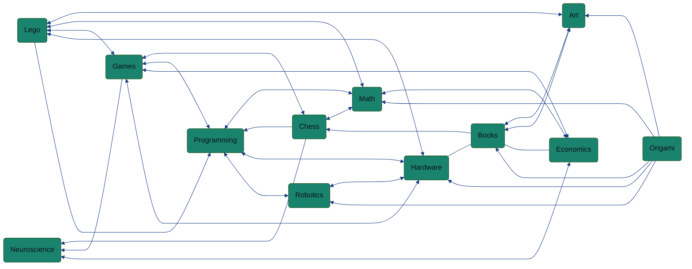

Robotics researcher, chess player, and origami enthusiast with interests in non-linear control algorithms, numerical solvers, and compilers.

<!---
Rockroyal305/Rockroyal305 is a ✨ special ✨ repository because its `README.md` (this file) appears on your GitHub profile.
You can click the Preview link to take a look at your changes.
--->

